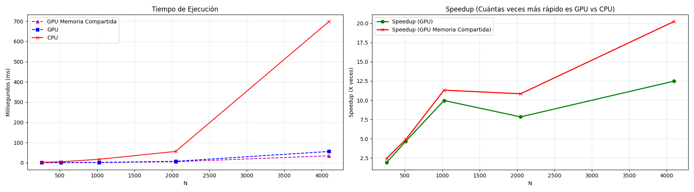

# Tarea 2: Matmul COMPA

**Asignatura:** Programación en Paradigmas Funcional y Paralelo (INFO188)

**Profesor:** Cristóbal Navarro

**Fecha:** 19 de diciembre 2025

**GitHub:** https://github.com/Jonagu1/info188-tarea02-2025

## Integrantes del Grupo

* Jonatan Aguero
* Mayra Carrillo
* Luciana Habert
* Alen Rupailaf
* Cristóbal Veas

## Descripción

Se implementa la mutiplicación de matrices de forma paralela usando distintos métodos:

- CPU: mediante **OpenMP**.
- GPU (con o sin memoria compartida): **CUDA**.

Lo anterior permite realizar la comparación de rendimiento entre CPU y GPU mediante gráficos para posteriormente elaborar conclusiones respecto a los resultados obtenidos.

## Estructura del repositorio

- `main.cu`: El código del programa principal. La CPU siempre prepara los datos (porque es más fácil generar aleatorios ahí), para posteriormente realizar multiplicación de matrices en CPU o en GPU (con o sin memoria compartida) dependiendo del algoritmo seleccionado.
- `Makefile`: Para compilar rápido usando make. Está configurado con -O3 (optimización) y se tuvo que añadir el parámetro arch=sm_50 para su correcto funcionamiento en tarjetas Nvidia GeForce MX130 (usada para pruebas rápidas).
- `benchmark.py`: Script de Python elaborado para automatizar el proceso de experimentación con el programa principal y la creación de gráficos para análisis.
- `benchmark_matmul.png`: El gráfico obtenido mediante el script `benchmark.py`.

## Ejecutar

### Programa principal

Las instrucciones se describen a continuación, son para ejecutar el programa en un entorno local (requiere tarjeta gráfica dedicada).

#### 1. Compilación

```bash
make
```

#### 2. Ejecución usando parámetros

```bash
./prog <n> <nt> <alg>
```

El parámetro `<alg>` permite elegir qué tipo de paralelismo usar:
    
- `1` = CPU multi threads con OpenMP
- `2` = GPU con CUDA
- `3` = GPU con CUDA aprovechando la memoria compartida (__shared__)

### Benchmark

El script de Python `benchmark.py` está adaptado para funcionar en el supercomputador [Patagón UACh](https://patagon.uach.cl/), usando las particiones `AI` y `A4000`. Para cambiar las particiones o usar el código de forma local, este debe ser modificado directamente.

#### 1. Descarga de librerías

Debido a que en el Patagón no hay acceso a `pip` ni a entornos virtuales de Python, debemos descargar las librerías localmente para posteriormente transferirlas al Patagón.

```bash
pip install matplotlib --target ./libraries --platform manylinux2014_x86_64 --only-binary=:all: --python-version 3.12
```

#### 2. Instalación de librerías en Patagón

El directorio `libraries/` que contiene nuestras librerías debe ser copiada al Patagón, en la carpeta donde hayamos clonado el repositorio actual.

```bash
scp -r -P 2237 ./libraries/ <usuario>@patagon.uach.cl:<directorio repositorio>
```

#### 3. Ejecución

El script automáticamente detecta las librerías de la carpeta `libraries/` (estrictamente debe tener ese nombre), por lo que ya puede ser ejecutado sin problemas.

```bash
python3 benchmark.py
```

## Resultados experimentales

Para la experimentación, se utilizó las particiones `A4000` (para matmul CPU) y `AI` (para matmul GPU con o sin memoria compartida) del Patagón, con el fin de hacer una comparación justa usando los recursos que estaban disponibles al momento de la ejecución (partición `cpu` estaba completamente ocupada). Es con ello que el hardware usado fue el siguiente:

- **CPU:** AMD EPYC 9534. Se limitó la ejecución a 24 hilos (`NT = 24`), que eran los que se encontraban disponibles.
- **GPU:** NVIDIA A100 40GB.

A continuación, se presentan las curvas de tiempo de ejecución y el factor de aceleración (Speedup) obtenido:



### Análisis de resultados

En el gráfico de Tiempo de Ejecución se observa que la versión CPU presenta un crecimiento acelerado del tiempo a medida que aumenta el tamaño de la matriz, alcanzando los **700 ms** para `N = 4096`. Las versiones GPU superan a la CPU a partir de tamaños de matriz medianos, manteniendo tiempos inferiores a **100 ms** para `N = 4096`. Para tamaños pequeños (`N < 500`), el beneficio es menor debido al overhead asociado al lanzamiento de kernels y a la gestión de la ejecución en GPU.

Asimismo, la versión GPU que utiliza memoria compartida presenta el mejor rendimiento en todos los tamaños evaluados, especialmente para matrices grandes `N > 2000`. Esto se explica porque el uso de memoria compartida reduce significativamente los accesos a memoria global, permitiendo una mayor reutilización de datos y un mejor aprovechamiento de la jerarquía de memoria de la GPU.

Respecto al gráfico de Speedup, se puede decir lo siguiente:

- **Overhead inicial:** Cuando la matriz es pequeña (`N < 500`), el Speedup se ve reducido debido al costo fijo que tiene el lanzar los kernels y la transferencia de memoria entre CPU y GPU.

- **Escalabilidad y memoria compartida:** A partir de `N = 1000`, la GPU empieza a ganar con crece ante la CPU. La implementación con memoria compartida logra un Speedup máximo de **~20.2x** respecto a la CPU, mientras que la versión normal alcanza un **~12.5x**. Lo anterior también demuestra la importancia del uso de la memoria compartida, la cual reduce drásticamente la cantidad de accesos a memoria global (más lenta), aliviando así el cuello de botella del bando de ancha.

### Conclusiones

Los resultados demuestran empíricamente la superioridad en el uso de las GPUs frente a las CPUs en problemas altamente paralelizables, como lo es la multiplicación de matrices. Lo cual nos hace ver que la decisión arquitectonica que tomemos respecto a los recursos que usemos (CPU o GPU) es crucial para que nuestros programas tengan un correcto desempeño, al trabajar con grandes cantidades de datos.

También se debe destacar el rol extremadamente importante del uso de memoria compartida en GPU la cual, sin siquiera cambiar el recurso que estamos usando, nos permitió obtener una ganancia adicional de casi **8x** sobre la CPU comparada a la versión normal. Lo que también nos demuestra que la forma en que se implemente la paralelización es vital para extraer el máximo rendimiento del hardware que estemos usando.
